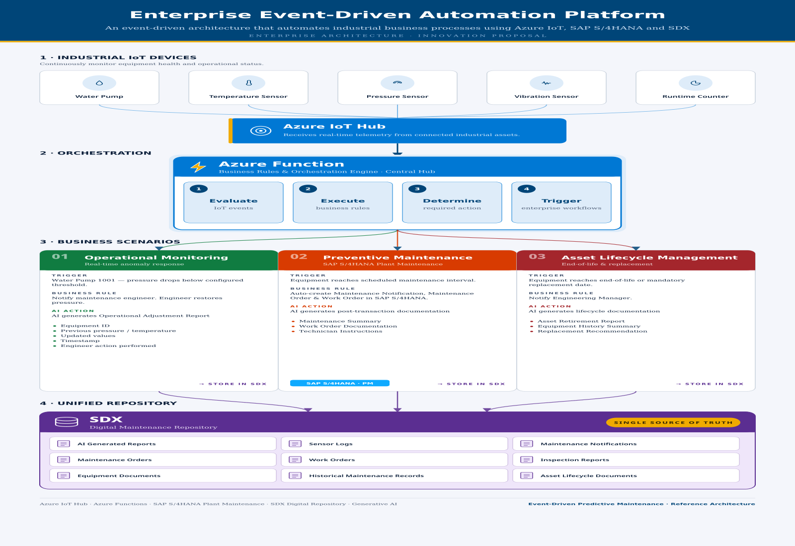

# Event-Driven Smart Predictive Maintenance Platform
## Enterprise Architecture Proposal 

> **Status:** Innovation Proposal

This repository presents an enterprise architecture proposal that I developed and submitted as an internal innovation initiative within my organization.

The solution proposes a scalable, event-driven predictive maintenance platform that integrates Microsoft Azure IoT, SAP S/4HANA Plant Maintenance (PM), Artificial Intelligence, and Hexagon SDx to automate enterprise maintenance processes.

## Business Challange

Industrial organizations are increasingly adopting Internet of Things (IoT) devices to continuously monitor the health and operational performance of equipments.

Although these sensors can detect abnormal operating conditions such as excessive vibration, high temperature, pressure fluctuations, or upcoming maintenance intervals. The operation and  maintenance process often still relies on manual intervention.

Engineers or maintenance planners typically need to:

- Review sensor alerts
- Analyze equipment conditions
- Create maintenance notifications
- Generate work orders
- Prepare supporting documentation
- Coordinate maintenance activities

These manual activities can result in:

- Delayed response times
- Increased administrative effort
- Unplanned equipment downtime
- Reduced asset availability
- Higher maintenance costs

## Proposed Solution

This proposal introduces an event-driven Smart Predictive Maintenance platform that integrates Microsoft Azure IoT services with SAP S/4HANA Plant Maintenance (PM) and Hexagon SDx to automate the maintenance lifecycle.

Industrial IoT devices continuously stream telemetry data into Azure IoT Hub, where Azure Functions evaluate incoming events, execute business rules, and orchestrate enterprise workflows.

Based on the detected events, the platform can automatically initiate business processes such as operational monitoring, preventive maintenance, and asset lifecycle management.

Artificial Intelligence augments these workflows by generating recommendations, maintenance order templates, operational reports, technician guidance, and asset lifecycle documentation.

At the core of the proposed architecture is **Hexagon SDx**, which acts as the enterprise engineering information repository and **single source of truth** for engineering documents, equipment information, maintenance records, AI-generated reports, and asset lifecycle documentation. By enriching real-time IoT telemetry with engineering context, SDx enables more informed maintenance decisions and provides a unified view of enterprise asset information.

By combining real-time IoT telemetry, enterprise business processes, and engineering information into a unified platform, the proposed solution enables faster decision-making, improved maintenance efficiency, and greater operational reliability.

## Solution Architecture

